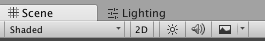
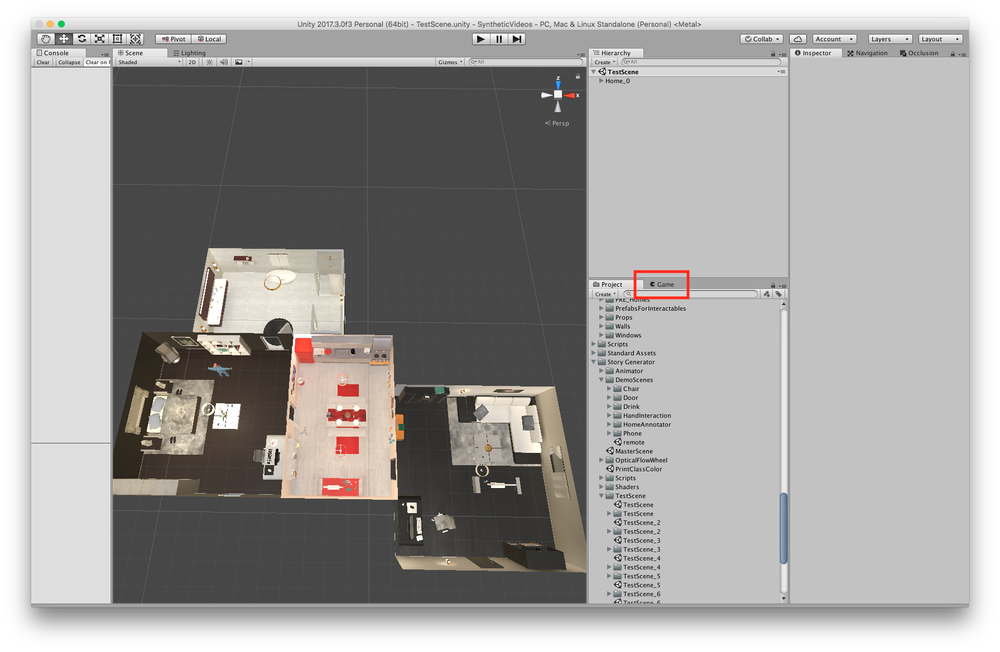

# IMPORTANT RULES!
#### Version
* Use __2018.4.\*__ LTS (As of Oct 30th, 2019)
* For Linux, you can find one here: https://forum.unity.com/forums/linux-editor.93/
* For MacOS, you can find it here: https://unity3d.com/unity/qa/lts-releases?version=2018.4
* More documentaions can be found under __doc/__ directory.

# Patches for Paid Assets
Paid assets aren't compatible with our code out of the box. 
* __Complete Home Interior Pack__: Some Prefabs need to be relocated/renamed. Run a script by executing __top menu__ > __Patch__ > __CHIP__. Wait few minuties to complete.
* __FInal IK__: Few lines of code needs some modification as of version. Refer to [this](doc/final_ik_mod.md)
* __Modern House Interior Pack__:
  * Some Prefabs need to be relocated/renamed. Run a script by executing __top menu__ > __Patch__ > __MHIP__. Wait few minuties to complete.
  * __NOTE__: Many of the newly introduced prefabs aren't being used in our code. You can modify `Assets/Resources/Data/object_prefab.json` to add more prefabs to each object class.

# Tips to boost Unity Editor Performance
* Disable scene lighting (it should be toggled off)

* Hide Game Window
  * Doesn't matter when you are rendering but you are viewing or editing the scene, not showing the __Game Window__ significantly increases responsiveness (refer to the image below)
  
  * Note that your window layout might be different from the image. This is just for reference.
