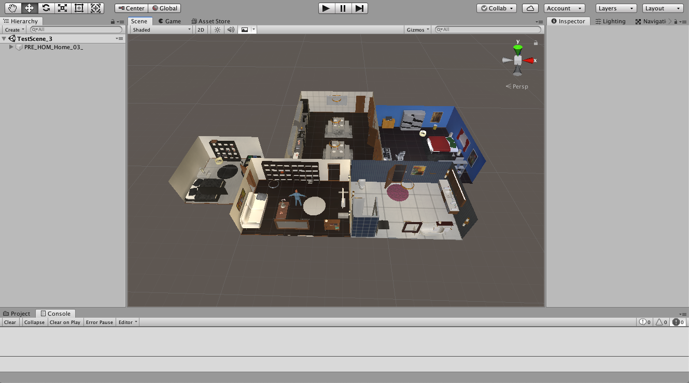

# VirtualHome Unity Source Code
This repository contains the source code of the VirtualHome environment, a platform to simulate complex household activities via programs. If you just want to run the simulator you can go to the main [VirtualHome repository](https://github.com/xavierpuigf/virtualhome), containing the VirtualHome API and executables of the simulator for multiple platforms. You can check more information about the project in [virtual-home.org](https://www.virtual-home.org)

<p align="center">
  
</p>


## Table of Contents
1. Overview
2. Cite
3. Set Up
4. Testing VirtualHome
5. Documentation 
6. License
7. Contributors

## Overview
VirtualHome is a platform to simulate human activities in household environments. Activities are represented as **activity programs** - lists of actions representing all the steps required to perform a given task. VirtualHome allows executing such programs to generate videos of the given activity. It also allows actions at every single step, and obtaining observations of the environment, making it a suitable platform for RL research.

This repository contains the source code to build the household environments, and translate the activity programs into low level actions that agents can execute. You can use it to modify VirtualHome to fit your research. If you want to use the simulator as it is, you can ignore this repository, and use the [VirtualHome API](https://github.com/xavierpuigf/virtualhome), along with the executables provided.

## Cite
If you use VirtualHome in your research, please consider citing the following paper.

```
@inproceedings{puig2018virtualhome,
  title={Virtualhome: Simulating household activities via programs},
  author={Puig, Xavier and Ra, Kevin and Boben, Marko and Li, Jiaman and Wang, Tingwu and Fidler, Sanja and Torralba, Antonio},
  booktitle={Proceedings of the IEEE Conference on Computer Vision and Pattern Recognition},
  pages={8494--8502},
  year={2018}
}
``` 

## Setup
### Install Unity
We have been using **Unity 2018.4.** for development. We recommend to install it through [Unity Hub](https://store.unity.com/download). 

### Clone the repository
Clone the repository with the Unity Source Code.

```bash
git clone https://github.com/xavierpuigf/virtualhome_unity.git
```

To test the simulator, we also recommend cloning the Unity API.
```bash
git clone https://github.com/xavierpuigf/virtualhome.git
```

### Including third party assets
VirtualHome uses a set of third party assets to include more 3D objects in the environment, and provide realistic motions for the agents. If you want to develop on the simulator, you will need to purchase these assets separately and include them in the source code. Find [here](doc/third_party.md) the documentation for how to install the assets.

**Note:** Purchasing these assets is only necessary if you want to work with the Unity Source Code. You can use the Unity Executables to generate videos or do RL research without purchasing any asset. The executables are found in the [VirtualHome API](https://github.com/xavierpuigf/virtualhome) repository and the [main webpage](https://www.virtual-home.org).

### Test the simulator
After the previous steps you should be able to test the simulator. Open a scene in VirtualHome using

```File > Open Scene > Assets/Story Generator/TestScene/TestScene_*.unity. ```

Once you do that, you shold see in the Scene window an apartment. The following image corresponds to opening *TestScene_3.unity*.

<p align="center">
  
</p>


Then, press the play button  in Unity and make sure there are no error messages. If you see that the play button stays toggled, you are ready to interact with the simulator.


## Interacting with the simulator
If you went through the previous steps and managed to press play without issues, you can start interacting with the simulator. For that, you need to use the [VirtualHome API](https://github.com/xavierpuigf/virtualhome). You will find all the details in that repository.

If you have cloned the repository, you can test it by entering in the repository and starting python

```bash
cd virtualhome
python
```

And create a comunication object **while Unity is in play mode**. 

```python
from simulation.unity_simulator.comm_unity import UnityCommunication
comm = UnityCommunication()
```

This object will communicate with Unity using port 8080. You can change that in the source code or using the Unity Executable.

To make sure that the tool works, try resetting the scene, adding a character, and walking to the fridge. Still in python, run:

```python
comm.reset(0)
comm.add_character()
comm.render_script(['<char0> [walk] <fridge> (1)'], find_solution=True)
```

You should see in Unity an agent walking towards the fridge. You can find more examples in [VirtualHome API](https://github.com/xavierpuigf/virtualhome).

### Generating an executable
You may want to interact with the simulator without using Unity. You can generate an executable so that VirtualHome runs without opening or installing Unity. You will then be able to run the tool both  on your desktop or in headless servers.

Check out the [docs](doc/build_exec.md) to learn how to generate the executable.

Note that we provide the current executables in [here](https://github.com/xavierpuigf/virtualhome). 

## Documentation
You can find more documentation of the VirtualHome executable in the [docs](doc).

## License
VirtualHome is licensed under creative commons. See the License file for more details.


## Contributors
The VirtualHome API and code has been developed by the following people.

- Marko Boben
- Xavier Puig
- Kevin Ra
- Andrew Liao
- Kabir Swain

