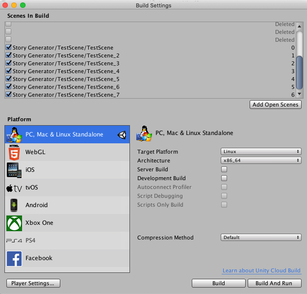

# Build an executable
After modifying the simulator, you may want to build an executable of VirtualHome, so that you can run it on multiple machines without installing Unity or in a headless server.

To build an executable, open the project, click on the top menu in Unity and select:

```
File > Build Settings
```

You should see a window like the one below


Make sure that the scenes you have built and the initial 7 scenes are included in the build, select your target platform and architecture and press Build. After a few minutes, an executable will be generated allowing you to run the simulator.