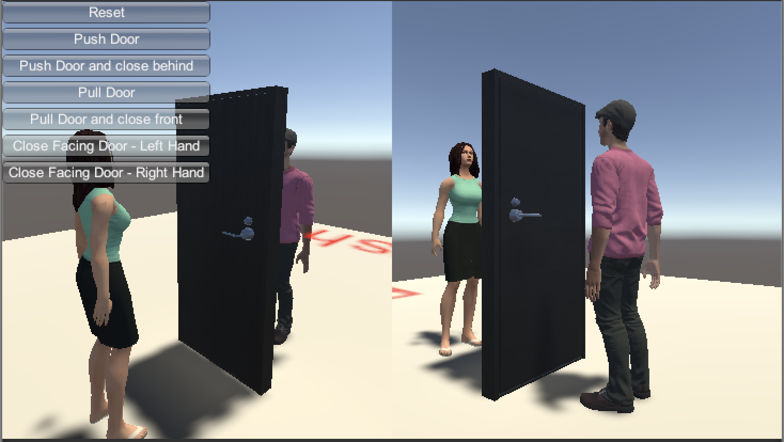

# 1. Door Interaction Demo
The door functionalirity is not currently included. We will be including it in future versions. This documentation is for reference only.

_Story Generatassetsor/DemoScenes/Door/Door.scene_

In real life, most residential doors are opened either by pushing or by pulling. We imposed the same limtation to our code. This demo scene demonstrates this behaviour of our code. 

## 1.1. DoorScene.cs
* In the Door scene, __MainDriver__ GameObject has __DoorScene.cs__ script attached to it.
* __Random Execution__ - If toggled, character will walk towards the door from a random position. Exception is __Close Facing Door__ actions. This uses IK (HandInteraction.cs) to close the door at current position.

* __Door__ - Door GameObject

* __ChrPush__ - Character GameObject that is standing on "push side" of the door. You can change character to another on in __Push__ GameObject.

* __ChrPull__ - Character GameObject that is standing on "pull side" of the door. You can change character to another on in __Pull__ GameObject.

## 1.2. GUI Buttons on Game Window
* __Reset__ - Resets the position of the characters and closes the door

* __Push Door__ - Opens door using ChrPush. Character will walk from random position if __Random Execution__ is toggled.

* __Push Door and close behind__ - Opens door using ChrPush and close it immediately. Behind simply means that the door is behind the character.

* __Pull Door__ - Opens door using ChrPull. Character will walk from random position if __Random Execution__ is toggled.

* __Pull Door and close front__ - Opens door using ChrPull and close it immediately. Front simply means that the door is in front the character.

* __Closing Facing Door - Left Hand__ - Closes door using IK (HandInteraction.cs). This is useful when character is facing the door to be closed and do not intent to move character forward while closing. _Due to the nature of our door models, using left hand to close opened door will be more natural at most times._

* __Closing Facing Door - Right Hand__ - Similar to above.

# 2. Relevant methods/classes
## 2.1. DoorHandleGroup.cs
Stores interaction/IK related GameObjects and provides method to retrieve them (to avoid using transform.Find(name of transform)). Each door will have two DoorHandleGroup component, one for each door handle.

## 2.2. Properties_door.cs
* Sets up door GameObject in order to make door GameObject work with our system
* Adds Rigidbody component and HingeJoint component to make it rotatable by applying torque over time. Apply force was tested but torque was more reliable and appropriate since door position must stay constant.
* HandInteraction component is added to support closing with IK.

* __ShouldPush__ - Determines whether a door should be pushed or pulled, based on position argument given. 

* __SetDoorToClose__ method can be used to close the door in the beginning, often useful for reset and preparing scene for door open action.

* __ForceCurve__ - AnimationCurve + multiplier. Torque values to open/close door are sampled from AnimationCurve and multiplied by the multiplier.

* __FindDoorJamb__
  * Move all doorjambs colliders to **Wall** layer, to prevent interference of door movement with doorjamb.
  * Find the rotation that makes the door closed. It depends on doorjamb's rotation.
  * Setup OffMeshLink across the doorjamb. Activated OffMeshLink allow NavMeshAgent to find a path across two walkable NavMeshArea by connecting them. This allows NavMeshAgent to find a path through a closed door.

* DoorHandleGroup - Spawns DoorHandleGroup for each handle.

## 2.3. CharacterControl.cs
### 2.3.1. walkOrRunWithDoorOpening
* If __autoDoorOpening__ is enabled, this method is called whenever a door is blocking a path. It opens and closes the door. For more information, refer to [this]((how2render.md).

### 2.3.2. DoorOpenLeft
* Opens a door either by pushing or pulling, which is determined by __ShouldPush__ method in Properties_door.cs

### 2.3.3. DoorCloseRightAfterOpening
* If a door should be close immediately after opening, this method is preferred for natural looking animation. Decision between **CloseDoorBehind** and **CloseDoorFront** is determined by how the door was opened (push or pull).

# 3. Current Limitations

## 3.1 Opening Animation Limitations
All door models from Complete_Home_Interior_Pack are opened with **left hand only**. Closing can be done with either hand. This is due to limitation of the following.

_Edit: These limitations can be overcomed. I found out you can flip the model by having negative scales in Transform and animation can be flipped by using Mirror in the import settings._

### 3.1.1. Our Door Model
* When you face the door, point of rotation on a hinge is on the left and door handle is on the right, as shown on the figure above. We don't have the other type of door model currently.

### 3.1.2. Our Door Opening Animation
* Although our door models are openable with any hand in real life, we don't have animation that uses right hand to open the door and look natural. Simple IK can be used when pushing a door with right hand though.

## 3.2 Stochastic
Amount of door being opened is not deterministic since applied torque is sampled from a animation curve on **Properties_doors** component. The sampled position is based on elapsed time between frames, which is not constant. This can be good or bad. It's good that we can have variety of door movement. It's bad that we don't have fine control over it so its behaviour might depend on scene to scene and maybe even between machines. If applied torque is too weak, door will block the character while if it's too strong, character will look like hulk. Possible alternative is to use animation clip.

# 4. Misc.
* During auto annotation, all walls of the house moved to **Wall** layer. If we don't do this, mesh collider on the walls interfere with door collider, preventing it from opening using torque. 
