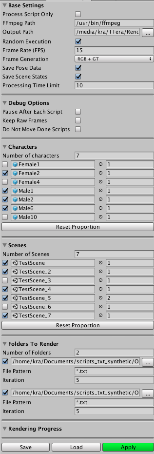

# DEPRECATED

## 1.1. Player Settings
* Under Other Setting, set __Color Space__ to __Linear__.

## 1.2. Quality Settings
* Set level to __Ultra__.

* Disable __Anti Aliasing__ (not a issue for RGB but it will introduce undesired colors on segmentation GT).

## 1.3. Game Window

* Must use 375 x 250 fixed resolution for the game.
* To add new resolution, inside the Game Window, click on menu on the right of __Display #__ where # is usually 1.
* At the bottom of the drop down list, click on __+__ to add new resolution.
* _Note_: You can view current Game window from the perspective of different ground truths we are generating (segmentation, depth and flow) by switching __display #__.

# 2. (Option 1) - Single Rendering
* Recommended for testing on a single scene.

## 2.1. Prerequisite
* If __Config__ folder doesn't exists, create one by copying __ConfigExample__ folder and renaming it to __Config__

## 2.2. Usage

* This mode reads __available_characters.txt__, __files_to_process.txt__, __scene_configuration.json__ in __Config__ folder in the beginning of the gameplay.
* Examples are located in directory that you just created by copying __ConfigExample__. The examples should be straight forward except __scene_configuration.json__, which is explained in depth on [2.3](#23-scene_configurationjson-details).
* Load any TestScenes from __Assets__/__Story Generator__/__TestScene__
* Start the game and the outputs will be stored on __Output__ directory.

## 2.3. scene_configuration.json Details
  * __randomizeExecution__ - Randomizes initial char pos, selection of object, lighting etc.
  * __randomSeed__ - Seed for randomization. -1 means don't change.
  * __processScriptOnly__ - If set to true, the planner only checks whether script is execuable or not. If it's not executable, it shows error. The result is written on Output/processing_info.txt. BE AWARE THAT THIS DELETES THE OLD FILE IN THE BEGINNING.
  * __processingTimeLimit__ - If planner takes longer than this time, it is considered as not executable.
  * __autoDoorOpening__ - After door close action, the char might stuck in a room. If set to true, the char will open and close the blocking door.
  * __frameRate__ - Recording FPS of the game. This is used later on video encoding stage. Note that fps below 10 severely degrades character navigation quaility.
  * __imageSynthesis__ - If true, generates all ground truths frames. If false, no frames are generated.
  * __captureScreenshot__ - If true, only RGB frames are generated. If false, no frames are generated. Don't set both this and imageSynthesis to true.
  * __savePoseData__ - Saves pose data of the character in each frame.
  * __saveSceneStates__ - Saves the state of the scene.

# 3. (Option 2) - Master Renderer
_For detailed documentation of how master rendering works, please refer to [master_renderer.md](master_renderer.md)._

* Recommend for rendering on multiple scenes and provides controls over which scene, characters, scripts and many other options as master.

## 3.1. Prerequisite
* If __Config__ folder doesn't exists, create one by copying __ConfigExample__ folder and renaming it to __Config__

## 3.2 Overview
* The window is basically a viewer for a config file you are editing, meaning what you see in the window doesn't represent the actual gameplay behaviour unless you click __Apply__ button (more on [here](#34-usage))
* In the beginning of the game play, it reads saved settings from __Config__/__RenderPreference.json__
* Since this mode uses JSON file, you can also edit the json file directly, instead of using the UI window to edit the file. The UI window is provided for convenience.

## 3.3. Master Settings Window
_To view this window, on the top menu, click __Window__ > __Master Settings__. The window that looks the image above will pop up_

### 3.3.1. Base Settings
* Options in this setting is quite similar to [scene_configuration.json](#23-scene_configurationjson-details)
* __FFmepg Path__ - To encode video from frames, we use ffmpeg binary file so the path to it must be provided.
* __Output path__ - Path to where output videos will be stored. Output of each scripts will be saved under **Output Path**/**\<current folder name\>**_rendered. For example, if current scripts are located under "scripts_a", The output will be saved to "Output Path/scripts_a_rendered".

### 3.3.2. Debug Options
* __Pause After Each Script__ - Enabling this will prevent the next script from being executed.
* __Keep Raw Frames__ - The rendered frames are usually deleted to save storage space. Enabling this will keep all frames used generate video. 
* __Do Not Move Done Scripts__ - Successfully rendered scripts are usually moved to the __Output Path__. Enabling this will prevent such behavior.

### 3.3.3. Characters and Scenes
* Characters and scenes are randomly sampled based on settings here.
* Set the __Number of *__ to the desired value to add lines below.
* __Checkboxes__ on the left column indicates whether it should be used.
* Characters and scens can be added to the middle column by __drag and drop__.
* Numbers on the right of column indicates the proportion of the element. Higher proportion means it is more likely to be sampled. Reset Proportion button will reset the proportion according to elements __in use__.

### 3.3.4. Folders To Render
* Set the __Number of Folders__ to the desired value to add lines below.
* __File Pattern__ - Only scripts that matches this pattern will be processed.
* __Iteration__ - How many times the scripts in the folder will be attempted to rendered? This is to maximize the script rendering because they cannot be rendered at one point but can on other points due to randomness (Assuming randomize options is enabled).

### 3.3.5. Rendering Progress
* As each processed scripts, __Rendering Progress__ would be updated.

## 3.4 Usage
### 3.4.1. Master Settings Window
* After you set the master settings, you can __Save__ or __Apply__.
* __Save__ - save the current setting as JSON file.
* __Load__ - Load JSON setting file.
* __Apply__ - saves current setting to __Config/RenderPreference.rp__. This is the file that will be read when Master Renderer starts so __ALWAYS__ click __Apply__ to use current setting during game play.

### 3.4.2. How to Render
* To start master renderer, open __MasterScene__ under Story Generator folder and simply start the game.
