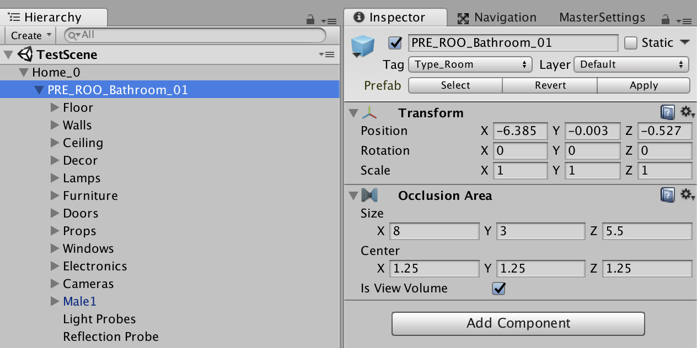
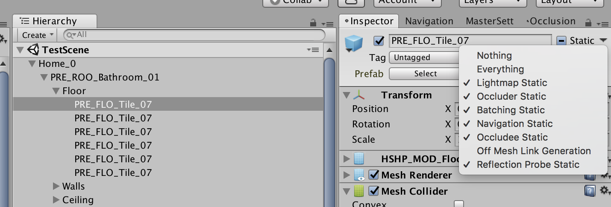
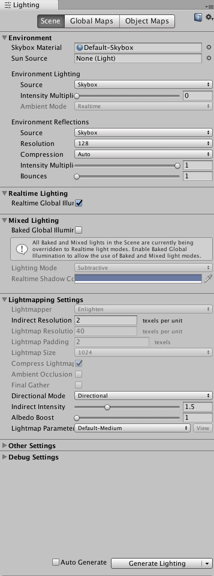
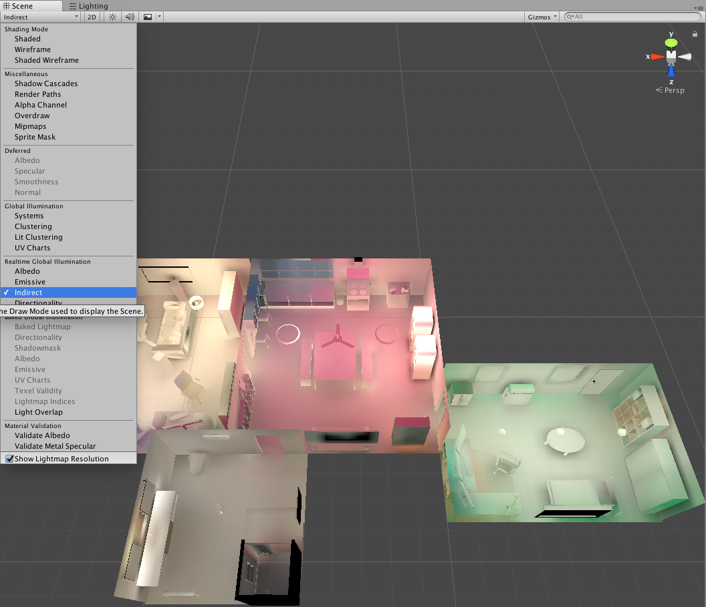

# Scene generation tips
This section contains some tips to take into account if you want to generate your own scene.

## 1. GameObject Hierarchy

* A scene has one GameObject, an apartment, and its children are rooms.
* The apartment GameObject must have __TestDriver.cs__ and __Recorder.cs__ attached to it.
* Rooms have __Type_Room__* tag and __[Occlusion Area](#3-occlusion-culling)__
* Objects placed inside a room are grouped by their category*. This allows easy annotation of objects.
* List Of Categories
  * Required means that a GameObject with the same name (e.g. Floor) must be a child of every room. It doesn't need to have any children though.
  * __Required__: Floor, Walls, Ceiling, Furnitures, Doors, Cameras (all cameras in a room are the children of this GameObject)
  * __Optional__: Appliances, Decor, Electronics, Lamps, Props, Windows,
  * It's okay to have other GameObjects not listed here. It just won't be processed by object annotator. They will be still grab-able though.

* Add any character from __Resources/Chars__ to a scene and make it child of a room* (any room is fine but it's preferred to place it under a room it physically belongs to).
* Add cameras in each room and place them under "Cameras" GameObject of each room. Making them the children of "Cameras" GameObject isn't necessary but it's preferred to have things grouped together when navigating Hierarchy view.
* Change layer of floor GameObjects to __Ground__ layer on the inspector view. (Reason: This is to prevent moving objects near the ground e.g. door from getting effected by the ground. Ground layer is changed so that it doesn't interfere with default layer.)

# 2. Lighting

### 2.1. Overview

* _Source: https://unity3d.com/learn/tutorials/topics/graphics/introduction-lighting-and-rendering?playlist=17102_

* Lighting is one of the key element that make our scene look more realistic
* As shown on the image above, we have direct and indirect lights.
* Due to the sheer amount of computation requirement, it's impossible to run a game smoothly while calculating indirect lights realtime.
* Hence, techniques to use _precomputed_ light data has evolved. As of Unity 2017.3, there's __Realtime Lighting__ and __Mixed Lighting__. 
  * __Realtime Lighting__ (previously: Precomputed Realtime GI) isn't fully realtime. It __precomputes__ lighting information beforehand and use them to calculate indirect lighting during gameplay.
  * __Mixed Lighting__ (previously: Baked GI) this bakes current indirect lighting into a texture and overlays them on top of the scene.
  * Realtime lighting uses more computation resources.
<!--  * _Note: Last time I thoroughly read Unity's Global Illumiation documentation, it wasn't recommended to have both Realtime Lighting and Mixed Lighting enabled because it's detrimental to performance. However, I read somewhere Unity redesigned their lightings so things might have changed so I might be wrong._
-->
### 2.2. GameObjects
* GameObjects not marked __Lightmap Static__ cannot have indirect lights. We must use [Light Probe](#23-light-probes) to blend between sampled light values.
  * This option is used for GameObjects that can move around. For example, a grabbed mug follows a character, which can be at any room. 

* Static GameObjects can get indirect lights by __Generate Lighting__ on the [Lighting Window](#25-lighting-window).
  * This option is used for GameObjects that is expected to stay still e.g. floor, wall, ceiling, furnitures appliances etc.

### 2.3. Light Probes
* When a GameObject is not __Lightmap Static__, the only why for it to receive indirect light is to rely on __Light Probe__
* Light probes _bakes_ light information passing through a empty space.

<!--#### 2.3.1. Placeing Light Probes
* Placing light probes manually would be very tedious job. I found some resources that handles automatic placement so stay tuned.
* (To be updated)-->

#### 2.3.1. Using Light Probes on non-static GameObjects
* To make sure the GameObject is using Light Probes to blend sampled indirect light values, go to its __Mesh Renderer__ component and set Light Probes to __Blend Probes__.
* If this option is greyed out, the object is __Lightmap Static__. Disabling this static option allows user to change Light probe options.
* An easy hack to identify GameObjects without LightProbe blending enabled is to swing __Intensity Mutlpier__ on __Lighting Window__/__Scene Tab__/__Environment__/__Environment Lighting__. Such GameObjects become nearly white when Intensity Multiplier is high.

### 2.4. Reflection Probe (Optional)
* This component makes reflective material (e.g. metals) to depict more realistic color based on what's nearby. 
* Create an empty GameObject and add __Refection Probe__ component. 
* Place the GameObject in the middle of the room and make it a child of a room it belongs to*
* Enable __Box Projection__ and set the __Box Size__ equivalent to room's dimension.
* (Optional) Adjust __Intensity__ to make a room brigher or darker.

### 2.5. Lighting Window

#### 2.5.1 Why Auto Generate is not useful for us

* When a new scene is created, __Auto Generate__ option is enabled by default and lighting data is re-computed as you update a scene.
* The problem with scenes that has Auto Generate enabled is that if the scene is loaded after game is started, Unity won't compute Global Illumiation so only direct lightings will present ([link](https://answers.unity.com/questions/1264278/unity-5-directional-light-problem-please-help.html)).
* This behavior only happens inside Unity Editor. People say that if we actually deploy our games, it wont' happen.
* Since we use Unity Editor to render frames, lighting data must be computed beforehand and saved as a file so that Unity can load them when the scene is loaded.

#### 2.5.2 Generate Lighting Data
* Open Lighting Window (Window --> Lighting) and go on Scene Tab
* Environment
  * Environtment Lighting
    * Set __Intensity Multiplier__ to 0. This makes scene much darker when lights are turned off.)
* Mixed Lighting
  * Disable __Baked Global Illumination__. We turn lights on and off so current light settings shouldn't be baked in to a scene.)
* Lightmapping Settings
  * (Optional) Adjust __Indirect Intensity__ and __Albedo Boost__ to make apartment a little brighter. Default is physically accurate but increasing the values won't hurt that much.
  * Once the scene lighting looks decent, disable __Auto Generate_ and hit __Generate Lighting__.
  * You can visualize the indirect lighting data by selecting __Realtime Global Illumination__/__Indirect__ from top left corner of Scene Window. 

### 2.5. Misc
* (Optional) Play around with properties of each light in __Inspector__ Window (range, intensity) to make it more realistic 
  * _Tip: it's good to keep the range relatively short and intensity high so that a light doesn't "smear" to other rooms. Unity doesn't handle lights getting blocked by walls very well. The fact that our wall 3D model is relatively thin makes it worse._

## 3. Occlusion Culling

* Slightly makes our game faster (simple test reveals +5 fps) by not rendering objects that are blocked by currently visible objects.
* Also used for defining a volume of a room in our code, which is used for spawning character at random position within a room.

### 3.1. GameObjects
* Similar to how GameObjects are marked Lightmap static, they must be marked __Occluder static__ and __Occludee Static__ to make Occlusion Culling work properlly.
* GameObjects that can move around must not be marked static.

### 3.2. Occlusion Area
* Add __Occlusion Area__ component to each room.
* Adjust its __Size__ and __Center__ to make it fully enclose the room.

### 3.2. Occlusion Window
* We can _bake_ occlusion data of static GameObjects.
* Open Occlusino Window (Window --> Occlusion Culling)
* On __Bake__ tab, set __Smallest Occluder__ to 3 and __Smallest Hole__ to 0.5. These values are empirically determined.
* Press __Bake__ button at the bottom right.

## 4. Navigation
* We use __NavMeshAgent__ to calculate character's path when a destination is set.
* We need to define which objects are _walkable_
<!--* _Note: There might be a way to perform these tasks programmatically and possibly different work flow. I'll update this section if I found one_-->

### 4.1. Navigation Window
* Open Navigation Window (Window --> Navigation)
* Go to __Object__ Tab

* Select floors GameObject and mark them __Navigation Static__ and __Walkable__ on __Navigation Area__
* Go To __Bake__ Tab
* Set "Agent Radius" to 0.3
* Set "Agent Height" to 1.8
* Press Bake and you will see walkable areas are marked with bright blue color on floors.
* _Tip: In case of weird navigation error (path not found while it's clearly not blocked by anything), Using **Manual Voxel Size** and lowering **Voxel Size** might be able to solve the issue. Most of our existing 7 apartments uses manual voxel due to werid navigation issue._

## Footnotes
*This structural requirement can be loosen up if it really hinders scene creation workflow
