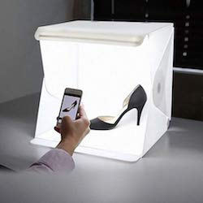
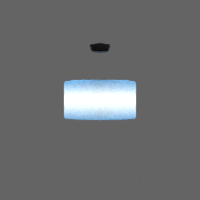

# Viewing individual objects
This documentation explains how to visualize single objects in Unity. We use a script to load objects, illuminate them, and rotate them around a given axis, for easy visualization.

## 1. What is a lightbox?

A lightbox is a enclosure that lights up an object of interest (in the image above, it's a shoe) with a soft light.

## 2. How does the code work?
* The code loads prefabs and rotates a camera around a pivot.
* The movement of the camera covers a hemisphere, centered at the object.
* The distance from the object is calculated on each iteration
* Using Newton's method, the calculated distance guarantees that the object's size on the image will be within the range specified in the json file.

## 3. How do I use it?
* Copy __lightbox.json__ file under __ConfigExample__ to __Config__ directory
* Adjust __lightbox.json__ (details are given on the following section)
* Open __Lightbox__ scene under __Assets__/__Story Generator__/__Lightbox__
* Create new Game window size whose width and height are equal (e.g. 500 x 500). This is because API to change camera resolution doesn't work in the Unity Editor. On how to add new Game window resolution, refer to [here](how2render.md#13-game-window)
* Play the scene
* Once it's completed, open the __saveLocation__ directory provided in the __lightbox.json__ file.

## 4. lightbox.json Details
* __fieldOfView__ - Field of view of the camera. The object will fulfill the specified proportion (min/maxProportion) of the image no matter what. This is used for how much perspective projection you want.
* __backgroundRGB__ - The background color of the image.
* __minProportion__ - Minimum proportion relative to the screen resolution allowed.
* __maxProportion__ - Maximum proportion relative to the screen resolution allowed.
* For example, if __minProportion__=0.4 to __maxProportion__=0.5 and screen size is (100x100), the maximum length of object on the image will be always between 40 to 50 pixels.
* __camAngleDelta__ - The rotation of camera's pivot will increment by this value for each iteration. 90 and 360 must be divisible by this value.
* For example, if __camAngleDelta__=90, the list of rotation of the pivot is like below:
  * (0, 0, 0)
  * (0, 90, 0)
  * (0, 180, 0)
  * (0, 270, 0)
  * (90, 0, 0)
  * (90, 90, 0)
  * (90, 180, 0)
  * (90, 270, 0)
* __brightness__ - Brightness of the light sources. The default value (1.2) seems to work on most cases. If a object appears to be washed out, lower this value.
* __saveLocation__ - Path to the directory where images will be stored.
* __gifOption__ - Options regarding gif creation.
  * __ffmpegPath__ - (optional) Absolute path to the ffmpeg binary file. If this is not provided, gifs won't be created.
  * __framerate__ - Framerate of the gif. The higher the values, the faster image transition takes place.
* __prefabs__ - Array of prefab class
  * __path__ - Relative path to the prefab from __Assets__/__Resources__.
  * __center__ (optional) - Center of the prefab in world coordinate.
  * __size__ (optional) - Size of the prefab in world coordinate.
  * If the object is annotated correctly, its center and dimensions can be obtained. Otherwise, the output images of this prefab will be incorrect. For such prefabs, you must specify its center and size on the __lightbox.json__ file. The last prefab in the example config file (__ConfigExample__/__lightbox.json__) has this attribute.
  * To determine the center and the size of a prefab:
    * Drag and them drop the prefab in to scene.
    * Select the prefab.
    * Add __Box Collider__ component to it by clicking __Add Component__ button on the inspector.
    * Edit the collider by clicking __Edit Collider__ button on the __Box Collider__ component to enclose this prefab.
    * Copy __center__ and the __size__ of the __Box Collider__ to the json file.
    * Remove the prefab in the scene.

## 5. Gif Examples
* Setting:
  * Game window = 200 x 200
  * fieldOfView = 30
  * backgroundRGB = [100, 100, 100]
  * minProportion = 0.4
  * maxProportion = 0.7
  * camAngleDelta=  45
  * brightness = 1.2

